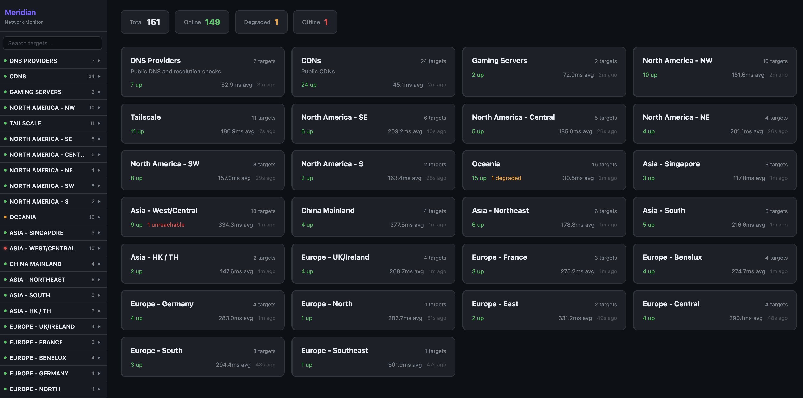
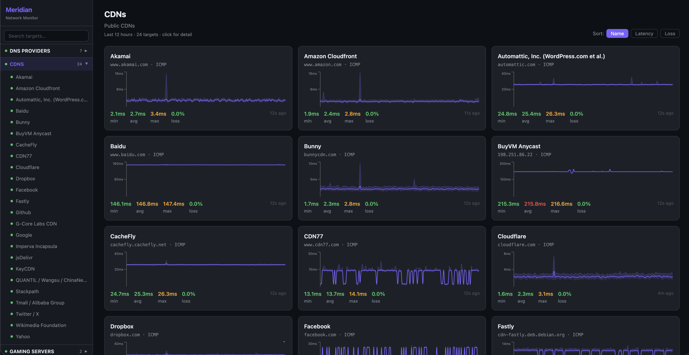
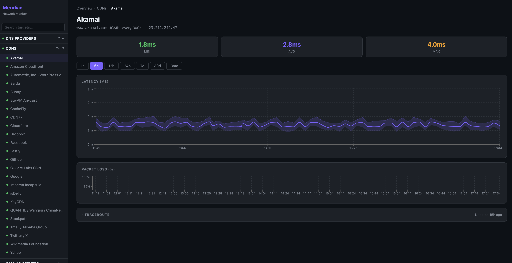
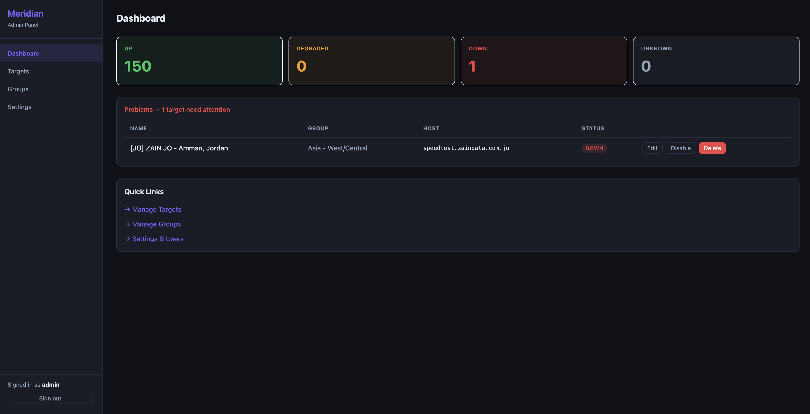
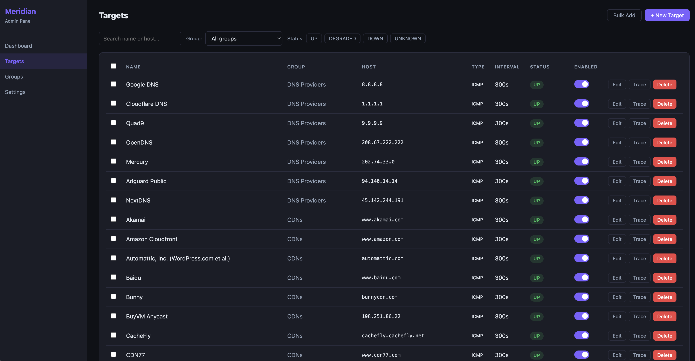

# Meridian

Modern network latency monitoring — a spiritual successor to SmokePing.

---

## Screenshots

**Public dashboard — overview**


**Public dashboard — group view**


**Public dashboard — target detail**


**Admin — dashboard**


**Admin — targets**


---

## Architecture

```
                           ┌─────────────────────────────────────────────┐
                           │                  Linux VPS                   │
                           │                                              │
  Browser (public) ──────▶ │  Cloudflare Tunnel ──▶ meridian-api         │
                           │                         (127.0.0.1:3001)    │
                           │                              │               │
  Browser (admin)  ──────▶ │  LAN / Tailscale   ──▶ meridian-admin       │
  (LAN/Tailscale only)     │                         (0.0.0.0:3002)      │
                           │                              │               │
                           │                         meridian-probe       │
                           │                         (no HTTP port)       │
                           │                              │               │
                           │                         SQLite (WAL)         │
                           │                         data/meridian.db     │
                           └─────────────────────────────────────────────┘
```

## Port Map

| Port | Process | Bind | Exposure |
|---|---|---|---|
| 3001 | `meridian-api` | `127.0.0.1` | Cloudflare Tunnel only |
| 3002 | `meridian-admin` | `0.0.0.0` | LAN / Tailscale only (never public) |
| — | `meridian-probe` | none | internal |

---

## Features

- **ICMP and DNS probing** with configurable intervals and packet counts
- **Latency charts** — raw, 5-min rollup, and 1-hour rollup with selectable time ranges
- **Uptime tracking** — 24h / 7d / 30d per target
- **Traceroute** — automatic daily runs per target with reverse DNS, path-change history stored when routes shift significantly
- **Status history ribbon** — last 20 probe outcomes per target
- **Groups** — targets organised into groups, drag-and-drop reordering in admin
- **Public dashboard** — read-only view with live search, group cards, per-target detail pages
- **Admin panel** — full CRUD for groups and targets, bulk add/edit/enable/disable/delete, group-filtered and status-filtered views
- **Data retention** — configurable rolling windows for raw, 5-min, and 1-hour data
- **Banner system** — info/warning/maintenance banners on the public dashboard
- **Rate limiting and security headers** on both servers

---

## Setup

### Prerequisites

- Node.js ≥ 18
- npm
- `ping` binary available (standard on Linux)
- `traceroute` binary available (`apt install traceroute`)
- PM2: `npm install -g pm2`
- (Optional) `cloudflared` for public access

### Quick start

```bash
git clone <your-repo> meridian
cd meridian
bash scripts/setup.sh
```

The setup script will:
1. Check Node.js ≥ 18
2. Install npm dependencies
3. Run database migrations (idempotent)
4. Optionally seed example targets
5. Create the initial admin user
6. Build both Vite frontends

Then start all processes:

```bash
pm2 start ecosystem.config.js
pm2 save
pm2 startup   # follow the printed command to enable auto-start
```

---

## Cloudflare Tunnel (public UI)

```bash
# Install cloudflared
curl -L https://pkg.cloudflare.com/cloudflare-main.gpg | sudo apt-key add -
echo "deb https://pkg.cloudflare.com/cloudflared $(lsb_release -cs) main" | sudo tee /etc/apt/sources.list.d/cloudflared.list
sudo apt update && sudo apt install cloudflared

# Authenticate
cloudflared tunnel login

# Create tunnel
cloudflared tunnel create meridian

# Route your domain to the public API
cloudflared tunnel route dns meridian your-domain.example.com

# Start tunnel pointing at the public API
cloudflared tunnel run --url http://127.0.0.1:3001 meridian
```

The public server already binds to `127.0.0.1` only, so it is not reachable without the tunnel.

---

## Firewall Recommendations

```bash
# The public API is on 127.0.0.1 — no firewall rule needed, it is not reachable externally.

# Block admin port from public internet
sudo ufw deny 3002

# If using Tailscale, allow admin port from Tailscale subnet only
sudo ufw allow from 100.64.0.0/10 to any port 3002

sudo ufw enable
```

---

## First Login

Navigate to: `http://<tailscale-or-lan-ip>:3002`

Use the admin credentials you created during setup.

---

## Upgrade Steps

```bash
git pull
npm install
node scripts/migrate.js
npm run build
pm2 restart all
```

---

## Configuration

Copy `.env.example` to `.env` and edit before first run.

| Variable | Default | Description |
|---|---|---|
| `PUBLIC_PORT` | `3001` | Public API / SPA port |
| `ADMIN_PORT` | `3002` | Admin API / SPA port |
| `DATABASE_PATH` | `./data/meridian.db` | SQLite database path |
| `SESSION_SECRET` | — | **Must be changed** — random 32-byte string |
| `TRUST_CF_HEADERS` | `true` | Trust `CF-Connecting-IP` for rate limiting |
| `RETENTION_RAW_DAYS` | `7` | Days to keep raw probe results |
| `RETENTION_5MIN_DAYS` | `30` | Days to keep 5-min aggregates |
| `RETENTION_1HOUR_DAYS` | `365` | Days to keep 1-hour aggregates |

---

## Probe Types

| Type | Mechanism | Metrics |
|---|---|---|
| ICMP | System `ping` binary | latency min/avg/max/mdev, packet loss, raw RTTs |
| DNS | Node `dns.resolve4()` | resolution time, success/fail, resolved IP |

---

## Traceroute

Traceroutes run automatically at startup and once daily per target (refresh window: 24 hours). A new history entry is stored whenever the path changes significantly (≥30% of hops differ from the previous run).

- Uses `traceroute -n` to avoid per-hop DNS delays during the trace
- Reverse DNS is resolved in parallel after the trace completes
- Up to 50 historical path snapshots are retained per target
- Private/RFC-1918 hops are hidden from the public view

---

## Security Notes

- Sessions: 32-byte random token, stored as SHA-256 hash, httpOnly cookie, 24h sliding expiry
- CSRF: double-submit cookie (`X-CSRF-Token` header + `csrf_token` cookie)
- Passwords: bcrypt cost factor 12
- Admin login: rate-limited to 10 attempts per IP per 15 minutes
- All SQL uses parameterised statements
- Rate limiting on public API: 600 requests/minute per IP
